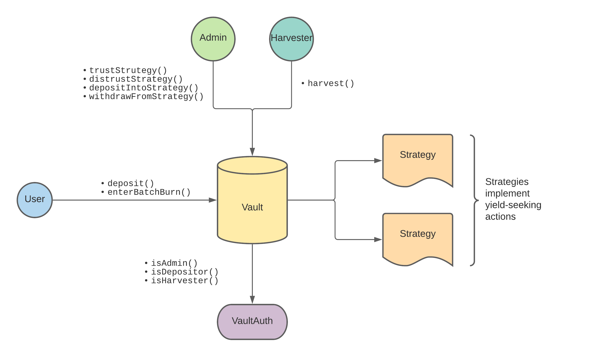

# vaults

A vault seeking for yield.

## Overview



### How batched burning works

Withdrawing from `vaults` is achieved through batched burning of shares. The flow for a batched burning round is:

- Users deposits shares when they want to withdraw. (contract-wise, the `userBatchBurnReceipts` mapping is populated when `enterBatchBurn` is called).
- Once enough deposits are done, an admin can call `execBatchBurn` to withdraw from strategies and burn the deposited shares. A snapshot of the current price per share will be done.
- Users can now withdraw their underlying using `exitBatchBurn`.

### Basic run

1. Create and activate a virtualenv for the project (using Python 3.8):

```
python3.8 -m venv venv
source venv/bin/activate
```

2. Install required packages:

```
pip install -r requirements.txt
```


3. Build the project:

```
brownie compile
```

4. Run tests

```
brownie test
```

### Acknowledgements

- Yearn
- Rari Capital
- Authors of EIP4626


# Foundry

Ensure you have Foundry installed with `foundryup`, then install the required dependencies:

```sh
forge install foundry-rs/forge-std
forge install OpenZeppelin/openzeppelin-contracts
forge install OpenZeppelin/openzeppelin-contracts-upgradeable
```
