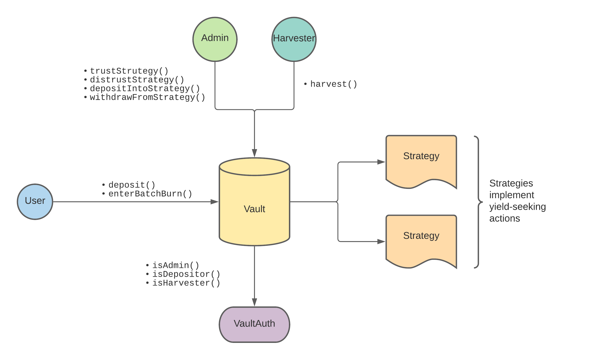

# vaults

A vault seeking for yield. Not fully ERC4626-compliant.

## Overview



### Basic run

1. Create and activate a virtualenv for the project (using Python 3.8):

```
python3.8 -m venv venv
source venv/bin/activate
```

2. Install required packages:

```
pip install -r requirements.txt
```


3. Build the project:

```
brownie compile
```

4. Run tests

```
brownie test
```

### Acknowledgements

- Yearn
- Rari Capital
- Authors of EIP4626